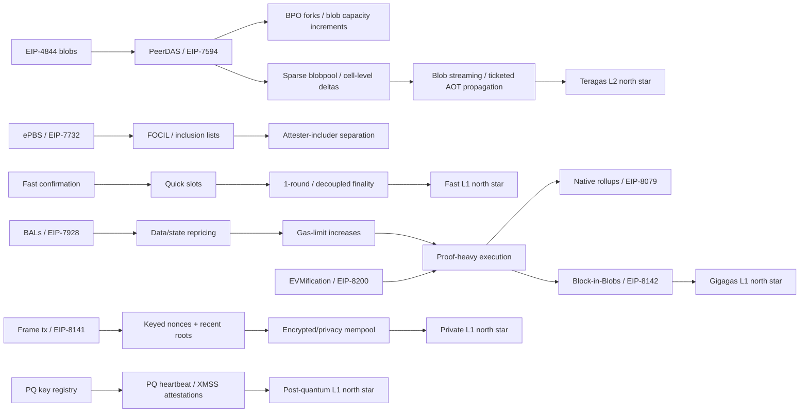

# Ethereum L1 Strawmap 研究报告

面向 Mantle dev team  
研究日期：2026-07-06（Asia/Shanghai）  
研究对象：https://strawmap.org/ 与其 Google Drawing 导出、所有可访问超链接、EIP/Forkcast/ethresear.ch/GitHub/EF 公开资料。

## 0. 结论摘要

Strawmap 不是一份“官方承诺排期”，而是 EF Architecture 给 Ethereum L1 未来数年升级路线做的一张协调草图。它把升级放在三层里理解：共识层负责更快确认、更强抗审查、更轻/更后量子安全的验证者机制；数据层负责把 blob/DA 从 4844 时代推向 PeerDAS、blob streaming 和更大规模 DAS；执行层负责把 L1 从“每个节点重执行一切”的模式，逐步推向更高 gas、更清晰状态访问、更强证明、更规整交易/账户模型，以及未来可能的 native rollups 和 RISC-V/zkVM 路线。[S1][S2]

对 Mantle 来说，核心信号不是“L2 被 L1 吞掉”，而是“L1 会越来越像高吞吐 rollup settlement/DA/proof coordination layer”。最相关的变化是：blob 供给与定价、PeerDAS/后续 DA 扩容、L1 finality 缩短、native rollups/zkEVM 证明接口、状态访问与证明成本、交易/mempool 隐私。Mantle 的 EigenDA-first 与 SP1/ZK validity 方向仍然成立，但需要持续重估 Ethereum blob DA fallback、证明延迟、finality 语义和未来 native-rollup 兼容性。[S10][S31][S32][S45]

最重要的阅读方式：Strawmap 右侧的 `fast L1`、`gigagas L1`、`teragas L2`、`post quantum L1`、`private L1` 是 north stars，不是已验证指标或确定交付目标。当前更可靠的“近期 fork 状态”应以 EIP meta / Forkcast 语言表达：例如 ePBS/EIP-7732 与 BALs/EIP-7928 scheduled for Glamsterdam，FOCIL/EIP-7805 declined for Glamsterdam but scheduled for Hegotá，Frame Tx/EIP-8141 considered for Hegotá。不要把 Strawmap 的年份、箭头和北极星数字写成确定承诺。[S1][S3][S4][S5]

## 1. 如何读 Strawmap

Strawmap 有三个横向层：

- CL / Consensus Layer：slots、finality、roles、validator aggregation、post-quantum consensus。
- DL / Data Layer：blob/DA throughput、sampling、blobpool、data pricing、payload availability。
- EL / Execution Layer：gas limit、state、proofs、EVM hardening、transactions、mempool、native rollups。

图中的箭头可以理解为两类关系：硬技术依赖，或者自然演进方向。报告中会把“明确依赖”和“推断依赖”分开写。[S1][S2]

状态语言：

- `scheduled for X`：进入对应 meta EIP 的 scheduled bucket。
- `considered/proposed for X`：处于对应 fork 的考虑/提议范围，不能写成会进 fork。
- `research / offchain / concept`：有研究帖、repo 或路线图概念，但不是确定 protocol feature。
- `north star`：长期目标，主要用于协调方向，不是当前吞吐或交付承诺。[S3][S4][S5]

## 2. Layer 级别分析

### 2.1 共识层：当前问题与路线动机

共识层的瓶颈不是单一的“finality 慢”，而是一组被 12s slot、epoch finality、大验证者集合、PBS/relay、抗审查与未来 PQ 签名共同放大的限制。当前 L1 用户、bridge、交易所与 L2 都受慢 finality 影响；同时，验证者数量接近百万级时，全量 attestation 聚合与单槽 finality 会在网络带宽、聚合轮次、签名大小上遇到上限。[S6][S39][S45][S57][S58]

因此 CL 路线分成三条线：

- 延迟线：fast confirmation、quick slots、slot duration decreases、1-round finality。
- 角色线：ePBS、FOCIL、attester/includer separation、distributed block building。
- 安全/可持续线：validator set/issuance、lean consensus、PQ heartbeat、PQ pubkey registry、XMSS attestations、secret proposers。

### 2.2 数据层：当前问题与路线动机

L2 扩容的短中期瓶颈仍是 DA。EIP-4844 引入 blobs 后，blob gas 与 execution gas 分离，但当前 blob 供给、blobpool 传播、KZG 验证、fee floor 与低需求阶段的价格信号都还不是终局设计。PeerDAS 的目标是让节点不下载全部 blob 数据也能参与 DA 安全；后续 sparse blobpool、cell-level deltas、blob streaming 则是在降低传播和 critical path 压力。[S10][S11][S13][S14][S15]

因此 DL 路线从“更多 blobs”升级到“更高效、可抽样、可预传播、可定价的数据可用性”。`teragas L2 / 1 Gbyte/sec` 是 north star：它表达的是通过 DAS 支撑数量级更高 L2 DA，而不是当前 spec 已经给出可执行参数。[S1][S10]

### 2.3 执行层：当前问题与路线动机

执行层的瓶颈更复杂：单纯提高 gas limit 会把执行、状态读写、block propagation、witness、state root computation、precompile 特例、mempool validation 和 node hardware 压力一起放大。因此 Strawmap 的 EL 路线不是“把 gas limit 拉满”，而是先 repricing、BALs、state/proof plumbing、EVM hardening，再走 zkEVM/native rollup/mandatory proof 和可能的 RISC-V/LeanVM 路线。[S18][S19][S20][S24][S26][S27][S32][S43]

对 Mantle 最关键的是：Ethereum L1 如果逐步把执行验证转向 proof-heavy 模式，rollup 证明、状态访问和 native-rollup 兼容性会变成 L2 架构设计的一部分，而不只是链下运营优化。[S31][S32][S33][S34]

## 3. 路线图依赖关系

明确依赖里，Fusaka/PeerDAS/BPO、Glamsterdam/ePBS/BALs、Hegotá/FOCIL 的状态最清晰。长程 I*/J*/K*/L* 主要是 Strawmap/PQ roadmap 里的规划链条，应以 milestone 或 research direction 表达。[S3][S4][S12][S46]

### 3.1 Strawmap 标签覆盖表

下表把 Google Drawing/PDF 中提取出的路线图标签映射到本报告中的分析位置。`merged` 表示它不是单独 EIP，而是并入相邻机制讨论；`unresolved` 表示没有找到足够明确的 canonical source，只保留为 Strawmap concept。

| Strawmap 标签 | 覆盖方式 | 主要来源 |
|---|---|---|
| fast L1 / finality in seconds / fast confirmation | `Fast confirmation / FCR` 行 | [S1][S6] |
| slot duration decreases / quick slots | `Slot duration decreases` 与 `Quick slots` 行 | [S3][S5][S7] |
| SFI | `SFI` 行，作为 EIP-7723 process status | [S5] |
| ePBS / attester-proposer separation / distributed block building | `ePBS`、`Attester-proposer / includer separation`、`Distributed block building` 行 | [S8][S56] |
| FOCIL | `FOCIL` 行 | [S3][S4][S9] |
| decoupled consensus / 1-round finality | `Decoupled consensus / 1-round finality` 行 | [S57][S44][S45] |
| 1M attestations per slot | `1M attestations per slot` 行 | [S39][S58][S59] |
| snail issuance | `Snail issuance` 行；exact phrase unresolved，按 issuance/validator-set policy 映射 | [S48][S49] |
| beacon & lean specs merge / tech debt reset / specs quantum | `Beacon & lean specs merge / tech debt reset` 与 PQ rows 合并覆盖 | [S7][S40][S41][S46] |
| 51% attack auto-recovery | 新增 `51% attack auto-recovery` 行 | [S50] |
| post quantum heartbeat / post quantum pubkey registry / PQ leanXMSS attestations | 对应 PQ rows | [S38][S39][S41] |
| VDF randomness / real-time CL proofs / secret proposers | 对应 CL rows | [S51][S40][S41][S52][S53] |
| teragas L2 / 1 Gbyte/sec / data availability increases | `DA increases / PeerDAS` 与 north-star caveat | [S1][S10] |
| sparse blobpool / cell-level deltas / local blob reconstruction / proofs of custody | DL rows | [S10][S13][S14] |
| blob streaming / short-dated blob futures | DL rows；`short-dated blob futures` 映射到 EIP-8256/ticketed reservation 而非金融 futures | [S15] |
| remove blob transaction type / leanVM / PQ leanDA sampling / leanDA block sampling / partial binary tree | DL/EL rows；`leanDA` exact label unresolved | [S31][S34][S40][S41][S46] |
| data repricing / multidimensional pricing | DL rows | [S17][S18][S21][S22][S23] |
| gigagas L1 / 1 Ggas/sec / gas limit increases | EL rows and north-star caveat | [S1][S18][S19] |
| ethp2p broadcast / ethp2p unification / sharded mempool | `ethp2p broadcast/unification` 与新增 `Sharded mempool` 行 | [S25][S37] |
| evm-asm canonical guest / state-asm / zkzkRISC-V frames | EL proving/ISA rows | [S26][S43] |
| Glamsterdam repricing / BALs | EL rows | [S20][S47] |
| optional 2-of-3 proofs / mandatory 1-of-1 proofs | Proof rows；数字短语按 Strawmap interpretation 处理，不作为 canonical term | [S24][S32] |
| validity-only partial state / decentralized state / endgame state / pureth purges | State rows | [S33][S34][S35] |
| EVMify long-tail precompiles | EIP-8200 row | [S27] |
| frame transactions / keyed nonces & recent roots / ephemeral keys | Transaction/account rows | [S28][S29][S30][S42] |
| native rollups | Native rollups row | [S31] |
| long-dated gas futures | Long-dated gas futures row; research only, no canonical EIP | [S54][S55] |
| PQ leanSPHINCS transactions | 新增 row；mapped to frame/PQ account-auth track, exact Strawmap label not a canonical EIP | [S28][S42][S46] |
| privacy mempool / encrypted mempool / private L1 / lean privacy wormholes | Privacy rows; `lean privacy wormholes` unresolved and mapped to privacy/PQ/leanVM research track | [S1][S36][S41][S42] |

## 4. 优化点明细

### 4.1 共识层优化点

| 优化点 | 当前瓶颈 | 原理/机制 | 引入后的变化 | 状态/依赖 |
|---|---|---|---|---|
| Fast confirmation / FCR | Ethereum finality 对 UX、bridge、交易所有约 15 min 级等待压力 | consensus-client 规则基于 attestation 条件给出一槽级确认，失败时回退到 finalized head | 正常网络下可给出约 13s 级 confirmation，但安全性弱于 finality | client-side/offchain；不需要 hard fork [S6] |
| Slot duration decreases | 12s slot 是 L1 inclusion latency 的基础下限 | 缩短 slot，比如 12s -> 6s，需要重新分配 proposal/attestation/aggregation deadline | inclusion 与 finality cadence 加快，但传播/验证压力上升 | EIP-7782 在相关讨论中出现，但 Glamsterdam meta 当前将其列为 declined；需谨慎 [S3][S5] |
| Quick slots / EIP-8198 | CL 客户端到处硬编码 12s 假设 | 先把 slot duration runtime-configurable，再 benchmark、逐步缩短 | 未来 slot reduction 从大改变成可配置路径 | Draft；更像基础设施准备 [S7] |
| SFI | fork scope 容易把“想研究”和“准备进入 fork”混淆 | EIP-7723 定义 Scheduled for Inclusion 等状态 | fork 治理语言更清晰 | process status，不是协议功能 [S5] |
| ePBS / EIP-7732 | PBS 依赖 relay/off-protocol trust，执行 payload 在 critical path | enshrine proposer-builder separation，用 commitment/PTC/延迟执行验证 | 降低 relay 信任和 critical-path payload 压力，改善 builder/proposer 角色分离 | Draft；scheduled for Glamsterdam；free-option/复杂性仍是风险 [S3][S8] |
| FOCIL / EIP-7805 | builder 集中使抗审查弱化 | committee 生成 inclusion lists，fork choice 强制满足 IL | 提升 forced inclusion 与 censorship resistance | Draft；declined for Glamsterdam, scheduled for Hegotá [S3][S4][S9] |
| Attester-proposer / includer separation | inclusion 与 state execution 混在一起，激励和费用不清晰 | 把 inclusion tx 与 state tx、includer 与 proposer/builder 角色拆开 | 更清晰的 inclusion fee 与抗审查路径 | Research；逻辑上在 PBS/FOCIL 之后 [S56] |
| Distributed block building | builder/relay 集中形成 chokepoint | 多方或分布式 builder/proposer 协作 | 降低单点与 relay 依赖，但协调复杂度上升 | Research / PBS 相关 [S8] |
| Decoupled consensus / 1-round finality | 单槽 finality 与全量验证者投票/聚合存在 tradeoff | heartbeat chain 与 trailing finality gadget 解耦 | 有机会在不让每个 slot 承担全量 finality 成本的情况下加快 finality | Research；依赖 committee、aggregation、networking [S57][S44][S45] |
| 1M attestations per slot | 大验证者集合下 naive 全量投票不可扩展 | 小 heartbeat committee + 后置 finality / aggregation | 让 fast path 更轻，同时保留更强 finality | Research；数字是压力场景，不是 spec 参数 [S39][S58][S59] |
| Snail issuance | 验证者集合增长会放大 CL 通信与聚合成本 | exact phrase 未找到 canonical source；最接近 Orbit SSF / issuance policy 对 validator-set growth 与 issuance curve 的讨论 | 可能降低长期 CL scaling 压力，但经济安全、solo staking 与中心化权衡未定 | unresolved label；按 issuance/validator-set policy research 处理 [S48][S49] |
| Beacon & lean specs merge / tech debt reset | beacon specs 与 lean/PQ/证明方向复杂度累积 | lean consensus/spec tooling 与 runtime-configurable timing | 降低客户端/规格技术债，为 PQ/fast finality 做准备 | offchain/spec work；EIP-8198/leanSpec 相关 [S7][S40][S41] |
| Post-quantum pubkey registry | validator PQ migration 需要提前生成/登记密钥，不能等激活时突击 | 先登记 PQ public keys，为 XMSS/哈希签名迁移做 warmup | 降低迁移操作风险 | Research；不是 finalized design [S38] |
| Post-quantum heartbeat | 全量 PQ aggregation 太重 | 小 heartbeat committee 可直接拼接 PQ signatures，finality 另走压缩/证明路径 | 让 PQ liveness fast path 更现实 | Research；依赖 dynamic availability/leanMultisig [S39][S41] |
| PQ leanXMSS attestations | BLS/ECDSA 长期受量子威胁；XMSS stateful 且大签名 | leanMultisig/leanVM 用递归证明压缩 XMSS 签名集合 | 提供 CL PQ attestation 方向，但 signer state discipline 很重 | Implementation/research；repo benchmark 不是协议保证 [S41] |
| VDF randomness | committee/proposer randomness 需要抗操纵 | RANDAO+VDF 等历史路线 | 提升 randomness 质量，但与新设计优先级关系不明 | 历史研究，当前 Strawmap 中属长程概念 [S51] |
| Real-time CL proofs | consensus 验证和 light-client/证明仍不够实时 | ZK-verified consensus / leanVM / recursive proofs | 未来可让 CL 验证更轻、更可组合 | Aspirational research [S40][S41] |
| Secret proposers | proposer 身份提前暴露可被 DoS | Whisk/SSLE 等秘密领导者选择 | 提升 proposer privacy 和 DoS resistance | Research；非近期承诺 [S52][S53] |
| 51% attack auto-recovery | 严重多数攻击后，在线节点需要一致判断哪个分叉/区块是 timely 或应恢复的链 | timeliness detectors 让客户端在同步假设下判断区块是否准时，并帮助识别/恢复攻击后的 canonical view | 目标是降低攻击后长期混乱与社会恢复负担，但依赖网络延迟假设和在线多数 | Research；不是当前 fork commitment [S50] |

### 4.2 数据层优化点

| 优化点 | 当前瓶颈 | 原理/机制 | 引入后的变化 | 状态/依赖 |
|---|---|---|---|---|
| DA increases / PeerDAS | blob 扩容如果要求节点全量下载，会推高带宽/存储 | PeerDAS 用 erasure coding、columns、sampling 让节点下载一部分数据 | 增加 blob/DA capacity 同时不线性增加节点负担 | EIP-7594 是核心 DA 升级；Fusaka/Fulu 相关 [S10] |
| Blob target/max bump | 4844 后 blob supply 有短期供给约束 | EIP-7691 提升 target/max blobs | 先给 L2 DA 更多 headroom | 近中期容量 bump [S11] |
| BPO forks | 每次调 blob 参数都 full hard fork 成本高 | EIP-7892 允许 blob-parameter-only forks | blob capacity 可更频繁调整 | PeerDAS/BPO 扩容工具 [S12] |
| Sparse blobpool / EIP-8070 | full-replication blobpool 占用 EL 带宽并影响 liveness | provider/sampler 角色分离，概率性 full fetch + custody-aligned sampling | 降低 blobpool 平均带宽，保留可用性验证路径 | Draft networking EIP [S13] |
| Cell-level deltas / EIP-8136 | 节点已有大部分 cells 时仍重复交换整列/大量数据 | 用 bitmap/request-response 只交换未见 cells | 降低 PeerDAS churn 与冗余带宽 | Draft；PeerDAS optimization [S14] |
| Local blob reconstruction | DAS 下并非所有节点都有完整 blobs | 基于采样/cell/proof 重建所需 blob data | 增强本地验证与恢复能力 | 与 PeerDAS/sparse blobpool 相关 [S10][S13] |
| Proofs of custody | 节点采样后需证明/约束自己 custody 的数据 | custody sampling + proofs / subnet responsibilities | 使 DAS 安全不依赖全量下载 | PeerDAS/DAS family [S10][S13] |
| Blob streaming / ticketed AOT | blob data propagation 仍在 critical path，naive EL pre-propagation 有 DoS 风险 | ticket-based ahead-of-time blobs + JIT blobs | 将部分 blob propagation 移出 critical path，给 L2 sequencer 更稳定提交窗口 | Draft/HackMD；EIP-8256 closest match [S15] |
| Short-dated blob futures | L2 需要提前锁定/平滑 blob capacity/cost | Strawmap 语境最接近 EIP-8256 ticketed reservation，而非金融 futures | 更像容量预留/传播设计，不是 derivatives market | 概念/研究；谨慎命名 [S15] |
| Remove blob transaction type | 未来 native-rollup/proof-heavy 模式下，blob tx 与 execution semantics 可能需规整 | EIP-8079/native rollups 不支持 blob tx，或将 DA 与 execution 接口重新组织 | 简化 native rollup STF 与 execution/DA 边界 | Draft/native rollup 路线 [S31] |
| Data repricing | blob/call/BAL bytes 的真实资源成本不匹配 | EIP-8131/8279/8311 等给 byte-dense 资源加 floor | 避免扩容后被便宜字节拖垮传播/状态 | Proposed/repricing cluster [S18][S21][S22][S23] |
| Multidimensional pricing / EIP-7999 | 单一 gas 无法同时给 execution、data、state、blob 正确定价 | 多资源维度统一 max_fee/reserve pricing | 用户预算更统一，资源定价更真实，但 builder packing 更复杂 | Draft；结构性 fee market 改造 [S17] |
| PQ leanDA sampling / leanDA block sampling | 长期 DA 还要考虑 PQ commitment 与更大规模 sampling | Hash/PQ-friendly DA commitments + sampling | 支撑 post-quantum L2 DA north star | 没有找到精确 canonical label；按 lean/PQ DAS research 处理 [S40][S46] |
| Partial binary tree | state/proof/witness 需要 PQ-friendly 树结构 | binary tree/hash-based state commitments | 减少 witness 并避免 Verkle 曲线长期 PQ 风险 | 更接近 EL/state；DL 图上作为数据结构 hardening [S34] |

### 4.3 执行层优化点

| 优化点 | 当前瓶颈 | 原理/机制 | 引入后的变化 | 状态/依赖 |
|---|---|---|---|---|
| BALs / EIP-7928 | state access 隐含在执行中，难以并行/预取/验证 | block-level access lists 显式记录访问账户/slot 与结果 | 支持并行 disk reads、validation、state-root computation、healing | Draft；scheduled for Glamsterdam [S3][S20] |
| Glamsterdam repricing / EIP-8007 | EVM gas 成本与实际瓶颈不匹配 | 作为 gas repricing directory 组织多个 repricing EIPs | 为更高 gas 与 parallelism 清理资源错价 | Meta/draft [S47] |
| Gas limit increases / EIP-7938 | block capacity 受 gas limit 与 client coordination 限制 | client default voting schedule 指数提升 gas limit | 提供容量提升路径，但 state growth/propagation 风险高 | Draft/非共识默认策略；不是直接承诺 [S19] |
| EIP-8131/8279/8311 repricing | calldata、BAL bytes、byte-dense cases 可绕过 floor | 64/96 gas/byte 等 floors + BAL runtime metering | 先收紧最坏块大小，再考虑 450M gas 级别分析目标 | Proposed/analysis；不是已定参数 [S18][S21][S22][S23] |
| ethp2p broadcast/unification | generic p2p 对大对象传播低效；CL/EL 带宽缺少统一控制 | erasure-coded broadcast、object-specific strategy、QUIC/ECH、slot-aware control | 改善 blocks/blobs/BAL/PTC/IL 等传播效率 | Repo/spec research；broadcast 已较具体，其它层仍研究 [S25] |
| Optional execution proofs / EIP-8025 | beacon nodes 依赖 EL re-execution 验证 payload | CL 可选择使用 execution proofs | 降低每个 verifier 跑 EL 的必要性 | Stagnant；作为 proof path concept [S24] |
| Mandatory proofs / 1-of-1 proofs | gigagas L1 下所有节点重执行不可持续 | zkEVM/real-time proofs 让验证转向 proof verification | execution validation 更轻，但 proving/state availability 成关键瓶颈 | Strawmap concept；具体由 EIP-8142/native rollups/zkEVM stack 支撑 [S24][S32] |
| Block-in-Blobs / EIP-8142 | 如果 validators 不再重执行，execution payload data availability 不能靠 re-execution 隐含保证 | 把 payload data 放入 blobs，并在 EL/CL 间绑定 blob commitments | proof-heavy execution 仍保持 DA | Draft；依赖 4844/7594/7732/7892/7928 [S32] |
| Native rollups / EIP-8079 | rollups 仍依赖外部证明/桥接信任模型 | L1 暴露/验证 Ethereum STF execution primitive | rollups 更接近继承 L1 security 与同步组合性 | Draft；长期架构方向 [S31] |
| evm-asm canonical guest | zkEVM guest 与 compiler trust/spec conformance 复杂 | Lean 4 verified macro-assembler over RV64 guest | 提高 STF guest 可验证性，减少 compiler trust | Prototype repo；非 production guest [S26] |
| state-asm / zkzkRISC-V frames | block execution proving 与 state/witness 成本高 | verified state transition / RISC-V zkVM substrate | 把 EVM execution 转成更适合证明的底层 ISA | Research/prototype；RISC-V replacement 仍讨论 [S26][S43] |
| LeanVM | PQ/lean stack 需要小型 zkVM/proof substrate | minimal hash-based zkVM + leanSig/compiler path | 为 lean/PQ signatures/proofs 提供 VM-native 路线 | Research repo [S41] |
| EVMify long-tail precompiles / EIP-8200 | precompiles 是 client/zkEVM special cases | 在相同地址部署等价 EVM bytecode，停止 native precompile 处理 | 降低共识特例与 zkEVM 特例，但 gas/perf 可能变化 | Draft；gas-sensitive contracts 风险 [S27] |
| Validity-only partial state / VOPS | weak statelessness 可能破坏 public mempool validity/censorship resistance | 保留足够验证 pending tx 的部分状态 | 在降低存储的同时保留 mempool 验证能力 | Research [S33] |
| Hyper-scaling state / new state forms | state 没有像 DAS/ZK 那样的单一 magic bullet | tiered/new state classes、temporary/UTXO-like storage | 把 future state 设计成更便宜但更受限的资源 | Research [S34] |
| Pureth purges / EIP-7919 | RPC/blocks/receipts/tx data 可验证性不足 | Pureth meta 关注 verifiable data access/RPC correctness | 降低轻客户端/RPC 信任，但不是直接 state-growth fix | Stagnant meta；label 映射有不确定性 [S35] |
| Decentralized/endgame state | 全状态存储、old state、witness 仍中心化 | statelessness、expiry、state providers、new state forms | 节点负担下降，但 RPC/indexer/old-state retrieval 更重要 | Research；Verkle vs binary trie 仍有分歧 [S33][S34] |
| Frame transactions / EIP-8141 | EOA/AA/PQ/key rotation/gas sponsorship 被现有 tx 格式限制 | transaction type `0x06`，frames for validation/payment/execution | 原生 batching、gas sponsorship、key rotation、PQ-friendly auth | Draft；considered for Hegotá [S4][S28] |
| Keyed nonces / EIP-8250 | shared sender/global nonce 串行化隐私协议和 relayers | `(nonce_key, nonce_seq)` 拆分 nonce domains | 提高同 sender 并发与 privacy/nullifier workflows | Draft/proposed for Hegotá [S4][S29] |
| Recent roots / EIP-8272 | validation 需要引用近期 roots，但直接读 mutable state 易失效/DoS | frame tx 引用 `(source_id, slot, root)`，预检查后暴露给 validation code | privacy trees、auth roots、wallet roots 更易安全绑定 | Draft/proposed [S30] |
| Ephemeral keys | 长期 ECDSA public-key exposure 有 PQ 风险 | AA/smart wallet 每笔交易/短周期换 key，或 hash-based few-time signatures | 降低长期 key exposure，但 pending mempool window 仍暴露 | Wallet/AA research；需 private mempool 缓解 [S42] |
| Announce tx with nonce / EIP-8077 | mempool propagation 缺少 sender/nonce hints | tx announcements 带 source address 和 nonce | 支持更精细 mempool/sharding/validation | Draft networking [S37] |
| Sharded mempool | 单一公共 mempool 在 blob/tx/nonce/privacy 路线下传播与验证压力上升 | 目前没有单一 canonical EIP；最接近的是 sparse blobpool、announce-with-nonce、encrypted/private mempool 的组合 | 可降低传播压力并让不同对象走专门路径，但会增加 mempool policy 与 DoS 面 | merged concept；见 EIP-8070/EIP-8077/EIP-8184 [S13][S37][S36] |
| Encrypted / privacy mempool / EIP-8184 | public mempool 暴露内容和排序机会 | sealed tx/bundle、commit-before-reveal、delayed key release | 降低 front-running/censorship/order-flow 泄露，但引入 reveal optionality/DoS/key trust | Draft；depends on FOCIL [S36] |
| Private L1 / shielded transfers | L1 原生隐私弱，应用层隐私依赖外部协议 | shielded transfer、privacy mempool、PQ-safe note discovery | 隐私成为 L1 一等能力，但 UX/compliance/ciphertext bloat 很难 | North star / research [S1][S36][S42] |
| PQ leanSPHINCS transactions | 账户签名长期需要 PQ-safe 替代，且现有 EOA/tx envelope 不适合大 PQ 公钥/签名 | exact label 无 canonical EIP；最接近 frame transactions + PQ account-auth / hash-based signature research | 可作为 post-quantum account-auth path，但签名大小、mempool、alias/key registry 仍未定 | Strawmap concept；mapped to frame/PQ AA track [S28][S42][S46] |
| Lean privacy wormholes | Strawmap 标签指向 lean/PQ/privacy 交叉方向，但没有找到同名 canonical source | 暂按 leanVM + encrypted/privacy mempool + shielded-transfer research 合并处理 | 表示长期 privacy primitive / proof-system 方向，不应写成确定功能 | unresolved label；merged into privacy/PQ research track [S36][S41][S42] |
| Long-dated gas futures | L2/应用需要长期 gas 成本确定性 | 研究中的 in-protocol gas futures/secondary markets | 可做 treasury/user fee hedging，但机制未定 | Research；非 canonical EIP [S54][S55] |

## 5. Mantle dev team 重点影响

1. DA strategy 不应静态化。即使 Mantle 当前继续 EigenDA-first，Ethereum blobs/PeerDAS/BPO/streaming 会改变 Ethereum fallback DA 的成本、可用性和市场风险。Mantle 应持续维护三套模型：EigenDA-only、Ethereum blob fallback、mixed DA。[S10][S11][S12][S15]

2. Blob pricing 会从“便宜 DA”走向更复杂的资源市场。EIP-7918/EIP-7999/8131/8279/8311 说明 Ethereum 正在处理 blob 与 execution/basefee 之间的价格信号失真。Mantle 若提供稳定 fee 产品，需要把 blob congestion 与 reserve pricing 纳入 treasury/ops 模型。[S16][S17][S18][S21][S22]

3. Faster L1 finality 会压缩 bridge 和 settlement UX 预期，但不会自动消除 L2 proof/finality 延迟。Mantle 对用户说明 finality 时，需要区分 L1 confirmation/finality、L2 validity proof finality、withdrawal finality。[S6][S45]

4. Native rollups 与 proof-heavy L1 会改变“Ethereum compatibility”的含义。未来兼容性可能不只是 EVM bytecode，还包括 proof interface、state/witness format、recent-root/auth-root/mempool rules。[S31][S32][S33]

5. Execution/state 路线会影响 prover operations。VOPS、BALs、state forms、BiB、evm-asm/RISC-V 都指向同一个事实：证明成本和状态访问模式会成为 L2 性能边界。Mantle 的 SP1/prover roadmap 应持续关注 Ethereum L1 对 witness、state root、payload DA 的标准化方向。[S20][S26][S32][S33][S34]

6. Mempool/privacy 预期会上升。若 L1 推进 FOCIL、LUCID、privacy mempool、shielded transfers，用户也会更关注 L2 sequencer ordering、fair ordering、private order flow。Mantle 应明确自己是否要 mirror L1 privacy/censorship-resistance features。[S9][S36][S37]

## 6. 主要不确定性与风险

- Strawmap 是 draft，不是 commitment。七个 forks 到 2029、六个月 cadence、north star 数字都应写成协调假设。[S1]
- EIP 状态变化快。报告中的 fork bucket 以 2026-07-06 抓取的 EIP meta/Forkcast 为准；后续需要复查。[S3][S4][S5]
- FOCIL 状态容易误读。它不在 Glamsterdam scheduled list，而是 Hegotá scheduled；旧讨论仍可能把它作为 Glamsterdam 候选，需要注明时间差。[S3][S4][S9]
- 6s slots / EIP-7782 在不同页面/讨论中可能出现漂移；当前不应写成确定 Glamsterdam feature。[S3][S5]
- `snail issuance`、`leanDA`、`short-dated blob futures`、`long-dated gas futures`、`lean privacy wormholes` 等标签没有全部找到精确 canonical source；报告中应标为 inferred/concept。
- 数字 claim 要降级：1 Ggas/s、1 GB/s、10K TPS、10M TPS 是 north star；450M/600M gas、PeerDAS sampling fraction、bandwidth reduction 是 proposal/model claim，不是交付承诺。[S1][S10][S18][S19]

## 7. 建议给 Mantle 的行动清单

1. 建立 DA cost sensitivity dashboard：current blobs、PeerDAS/BPO-expanded blobs、EigenDA-only、mixed fallback 四种情景。
2. 把 “finality” 文档拆成三层：L1 confirmation/finality、L2 proof finality、bridge withdrawal finality。
3. 对 native rollup readiness 做架构评估：是否需要兼容未来 `EXECUTE`/L1-verified STF 类接口。
4. 给 prover team 建立 Ethereum L1 proof/state watchlist：BALs、VOPS、BiB、EIP-8141/8272、evm-asm/RISC-V、state tree alternatives。
5. 对 sequencing/mempool 做隐私与抗审查差距分析：FOCIL、encrypted mempool、sender/nonce leakage、private order flow。
6. 在研究报告或内部分享中，避免把 Strawmap north stars 写成“EF 确认的交付目标”。

## Sources

- [S1] Strawmap landing page and FAQ, `https://strawmap.org/`, local HTTP 200 export, accessed 2026-07-06.
- [S2] Strawmap Google Drawing export, `https://docs.google.com/drawings/d/1GkcGfQv9kxgrYQMyu0BYGcZya0gIDG_wQ7GsFJEsdzY/export/png`, accessed 2026-07-06.
- [S3] EIP-7773 Hardfork Meta - Glamsterdam, `https://eips.ethereum.org/EIPS/eip-7773`.
- [S4] EIP-8081 Hardfork Meta - Hegotá, `https://eips.ethereum.org/EIPS/eip-8081`.
- [S5] EIP-7723 process/status definitions, `https://eips.ethereum.org/EIPS/eip-7723`.
- [S6] Fast Confirmation Rule, `https://fastconfirm.it`.
- [S7] EIP-8198 Quick Slots, `https://eips.ethereum.org/EIPS/eip-8198`.
- [S8] EIP-7732 Enshrined Proposer-Builder Separation, `https://eips.ethereum.org/EIPS/eip-7732`.
- [S9] EIP-7805 FOCIL, `https://eips.ethereum.org/EIPS/eip-7805`.
- [S10] EIP-7594 PeerDAS, `https://eips.ethereum.org/EIPS/eip-7594`.
- [S11] EIP-7691 Blob throughput increase, `https://eips.ethereum.org/EIPS/eip-7691`.
- [S12] EIP-7892 Blob-parameter-only forks, `https://eips.ethereum.org/EIPS/eip-7892`.
- [S13] EIP-8070 Sparse Blobpool, `https://eips.ethereum.org/EIPS/eip-8070`.
- [S14] EIP-8136 Cell-Level Deltas, `https://eip.tools/eip/8136`.
- [S15] Blob streaming HackMD / EIP-Blob-streaming, `https://hackmd.io/@gMH0wL_0Sr69C7I7inO8MQ/B125sCUtZx`.
- [S16] EIP-7918 Blob base fee bounded by execution cost, `https://eips.ethereum.org/EIPS/eip-7918`.
- [S17] EIP-7999 Unified multidimensional fee market, `https://eips.ethereum.org/EIPS/eip-7999`.
- [S18] Hegotá Repricings, `https://misilva73.github.io/hegota-repricings/`.
- [S19] EIP-7938 Exponential Gas Limit Increase, `https://eips.ethereum.org/EIPS/eip-7938`.
- [S20] EIP-7928 Block-Level Access Lists, `https://eips.ethereum.org/EIPS/eip-7928`.
- [S21] EIP-8131 transaction-content byte floor, `https://raw.githubusercontent.com/ethereum/EIPs/master/EIPS/eip-8131.md`.
- [S22] EIP-8279 BAL byte floor, `https://raw.githubusercontent.com/ethereum/EIPs/master/EIPS/eip-8279.md`.
- [S23] EIP-8311 calldata repricing, `https://raw.githubusercontent.com/ethereum/EIPs/master/EIPS/eip-8311.md`.
- [S24] EIP-8025 Optional Execution Proofs, `https://eips.ethereum.org/EIPS/eip-8025`.
- [S25] ethp2p repo, HEAD `741d8d9cf682ff93b7d8eb56e0377ba8eea83a7e`, `https://github.com/ethp2p/ethp2p`.
- [S26] Verified-zkEVM/evm-asm repo, HEAD `864fbe8ced0dee1bf5d4371b72d025a5a9319f97`, `https://github.com/Verified-zkEVM/evm-asm`.
- [S27] EIP-8200 EVMification, `https://eips.ethereum.org/EIPS/eip-8200`.
- [S28] EIP-8141 Frame Transaction, `https://eips.ethereum.org/EIPS/eip-8141`.
- [S29] EIP-8250 Keyed Nonces for Frame Transactions, `https://eips.ethereum.org/EIPS/eip-8250`.
- [S30] EIP-8272 Recent Roots for Frame Transactions, `https://eips.ethereum.org/EIPS/eip-8272`.
- [S31] EIP-8079 Native rollups, `https://eips.ethereum.org/EIPS/eip-8079`.
- [S32] EIP-8142 Block-in-Blobs, `https://eips.ethereum.org/EIPS/eip-8142`.
- [S33] VOPS research, `https://ethresear.ch/t/a-pragmatic-path-towards-validity-only-partial-statelessness-vops/22236`.
- [S34] Hyper-scaling state research, `https://ethresear.ch/t/hyper-scaling-state-by-creating-new-forms-of-state/24052`.
- [S35] EIP-7919 Pureth Meta, `https://eips.ethereum.org/EIPS/eip-7919`.
- [S36] EIP-8184 LUCID encrypted mempool, `https://eips.ethereum.org/EIPS/eip-8184`.
- [S37] EIP-8077 announce transactions with nonce, `https://eips.ethereum.org/EIPS/eip-8077`.
- [S38] PQ public-key registry research, `https://ethresear.ch/t/exploring-the-design-space-for-a-post-quantum-public-key-registry-for-ethereum-validators/25040`.
- [S39] Dynamic availability / PQ heartbeat research, `https://ethresear.ch/t/why-ethereum-needs-a-dynamically-available-protocol/24418`.
- [S40] Lean Ethereum EF post, `https://blog.ethereum.org/2025/07/31/lean-ethereum`.
- [S41] leanEthereum/leanMultisig / leanVM repo, HEAD `12e61512416548e743040aab4daf83c58a5c5476`, `https://github.com/leanEthereum/leanMultisig`.
- [S42] Ephemeral keys and account abstraction research, `https://ethresear.ch/t/achieving-quantum-safety-through-ephemeral-key-pairs-and-account-abstraction/24273`.
- [S43] RISC-V execution-layer proposal, `https://ethereum-magicians.org/t/long-term-l1-execution-layer-proposal-replace-the-evm-with-risc-v/23617`.
- [S44] One-round finality note, `https://notes.ethereum.org/@yannvon/S1wIxIDqbe`.
- [S45] ethereum.org single-slot finality page, `https://ethereum.org/roadmap/single-slot-finality/`.
- [S46] ethereum.org quantum-resistance roadmap, `https://ethereum.org/roadmap/future-proofing/quantum-resistance/`.
- [S47] EIP-8007 Glamsterdam Gas Repricings, `https://eips.ethereum.org/EIPS/eip-8007`.
- [S48] Orbit SSF validator-set management research, `https://ethresear.ch/t/orbit-ssf-solo-staking-friendly-validator-set-management-for-ssf/19928`.
- [S49] Practical endgame on issuance policy, `https://ethresear.ch/t/practical-endgame-on-issuance-policy/20747`.
- [S50] Timeliness detectors and 51% attack recovery, `https://ethresear.ch/t/timeliness-detectors-and-51-attack-recovery-in-blockchains/6925`.
- [S51] Minimal VDF randomness beacon, `https://ethresear.ch/t/minimal-vdf-randomness-beacon/3566`.
- [S52] Whisk practical shuffle-based SSLE, `https://ethresear.ch/t/whisk-a-practical-shuffle-based-ssle-protocol-for-ethereum/11763`.
- [S53] Secret non-single leader election, `https://ethresear.ch/t/secret-non-single-leader-election/11789`.
- [S54] On in-protocol gas futures, `https://ethresear.ch/t/on-in-protocol-gas-futures/23698`.
- [S55] How to purchase Ethereum GAS in advance, `https://ethresear.ch/t/how-to-purchase-ethereum-gas-in-advance/19069`.
- [S56] Towards Attester-Includer Separation, `https://ethresear.ch/t/towards-attester-includer-separation/21306/1`.
- [S57] Unblocking faster finality with decoupled consensus, `https://ethresear.ch/t/unblocking-faster-finality-with-decoupled-consensus/24527/1`.
- [S58] Horn: collecting signatures for faster finality, `https://ethresear.ch/t/horn-collecting-signatures-for-faster-finality/14219`.
- [S59] LMD GHOST with 256 validators and a fast-following finality gadget, `https://ethresear.ch/t/lmd-ghost-with-256-validators-and-a-fast-following-finality-gadget/22856`.

## Methodology Appendix

- First wave: 14 parallel research lanes covered Strawmap inventory, CL latency, CL/PQ scalability, DA throughput, DA economics, EL throughput, EL proving, EL state, EIP metadata, linked repos/docs, dependency graph, Mantle implications, PQ/privacy, skeptic audit.
- Expansion waves: fork-meta reconciliation; execution/privacy interfaces; gas/pricing/EVM hardening crosswalk.
- Local artifacts: `strawmap.html`, `strawmap.svg`, `strawmap.pdf`, `strawmap.png`, `strawmap-pdf.txt`, `strawmap-links-clean.txt`, `sources-fetch-index.json`.
- Access gap: linked Google published doc returned HTTP 401/404 in this environment; it is not used as a report source.
